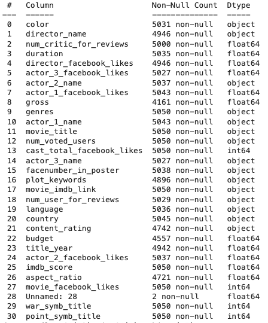
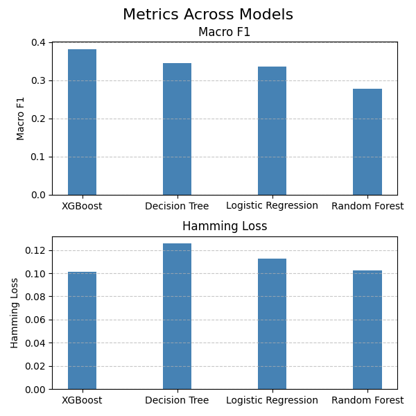
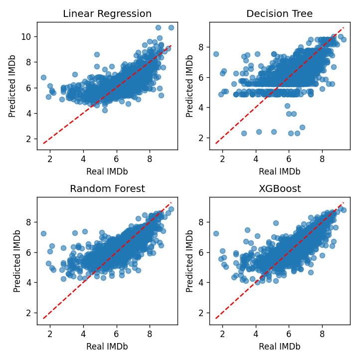
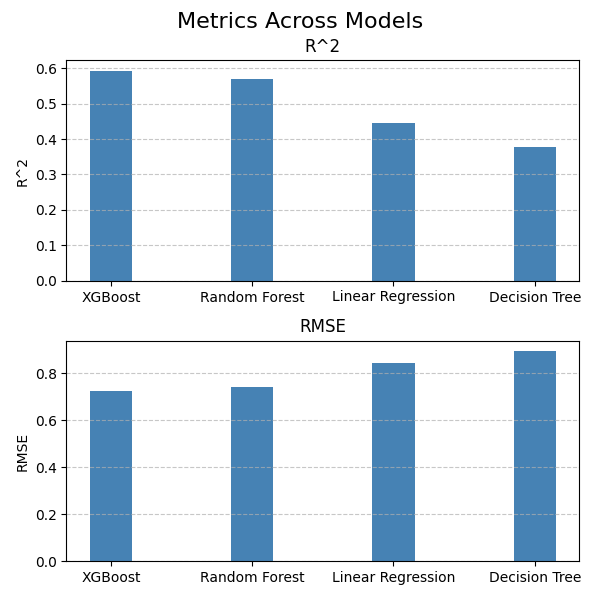

# Movie Analysis: Multi-label Classification & Regression 🎬

This repository contains project that explores movie metadata through two distinct lenses: **Multi-label Classification** to predict multiple movie genres for a single film and **Regression** to estimate IMDB scores.

### Data



### 1. Multi-label Classification (Genre Prediction)
Unlike standard classification, this task handles overlapping labels:
* **Approach:** One-vs-Rest (OvR) strategy for classical models and multi-output architectures for Neural Networks.
* **Classic ML:** Random Forest and One-Vs-Rest Logistic Regression.
* **Deep Learning:** * **Output Layer:** `Sigmoid` activation function to allow multiple independent probabilities.
    * **Loss Function:** `Binary Crossentropy` applied across all label outputs.
    * **Preprocessing:** MultiLabelBinarizer for transforming the `genres` column.

<div align="center">
   
</div>

### 2. Regression (IMDB Score Prediction)
Predicting the exact numerical rating:
* **Classic ML:** Linear Regression, Random Forest Regressor, and XGBoost.
* **Deep Learning:** * **Architecture:** Multi-layer Perceptron (MLP) with `ReLU` activations.
    * **Output Layer:** Linear activation for continuous value prediction.
    * **Loss Function:** Mean Squared Error (MSE).

      
<div align="center">
   
   
</div>


## Data Pipeline

* **Feature Engineering:** Processing the `genres` string (e.g., `Action|Sci-Fi`) into a binary matrix.
* **Text Processing:** Basic NLP techniques applied to `plot_keywords`.
* **Scaling:** `StandardScaler` applied to numerical features like `budget`, `gross`, and `facebook_likes` for Neural Network stability.

## Evaluation Metrics

* **Classification:** Hamming Loss, F1-Score (Micro/Macro), and Precision-Recall curves.
* **Regression:** Mean Absolute Error (MAE), Root Mean Squared Error (RMSE), and $R^2$ Score.

## Installation & Usage

1.  **Clone the repository:**
    ```bash
    git clone [https://github.com/metrych-creator/cinemas.git](https://github.com/metrych-creator/cinemas.git)
    ```
2.  **Install dependencies:**
    ```bash
    pip install pandas numpy scikit-learn tensorflow matplotlib seaborn
    ```
3.  **Run the analysis:**
    Execute the `movies.ipynb` notebook to see the data processing, training, and evaluation steps.

---
